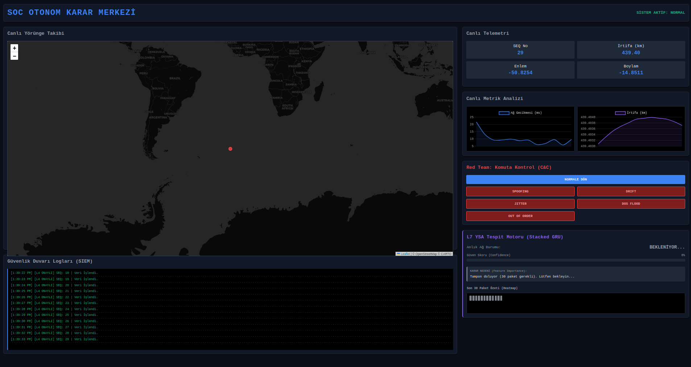
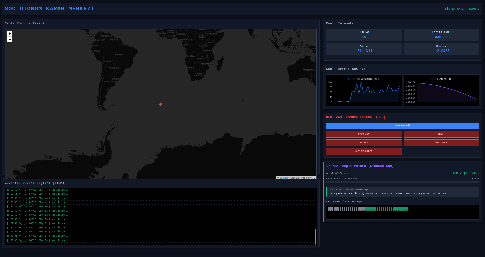
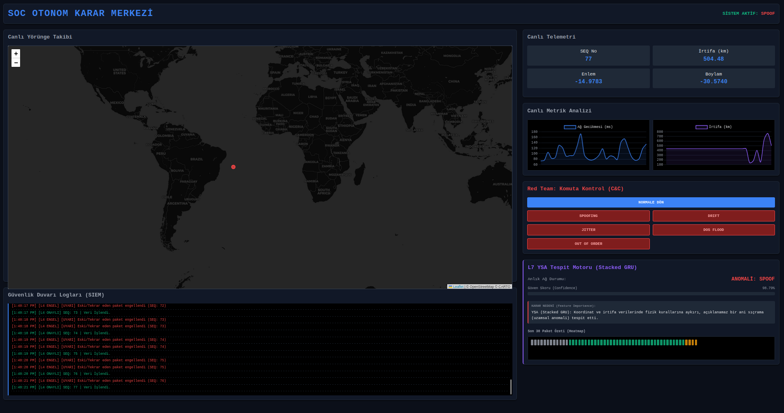
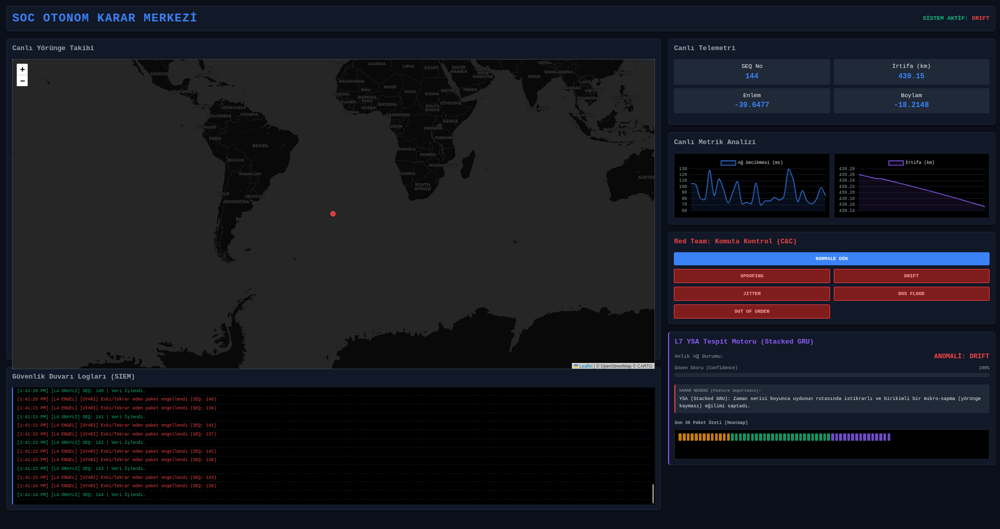
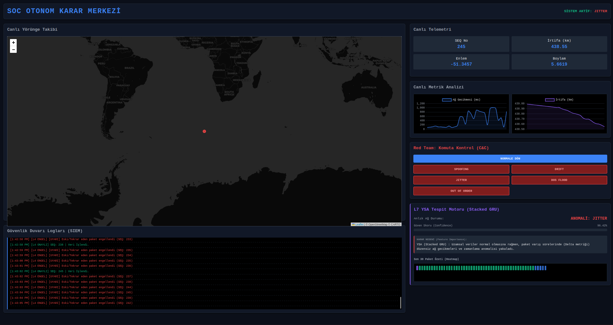
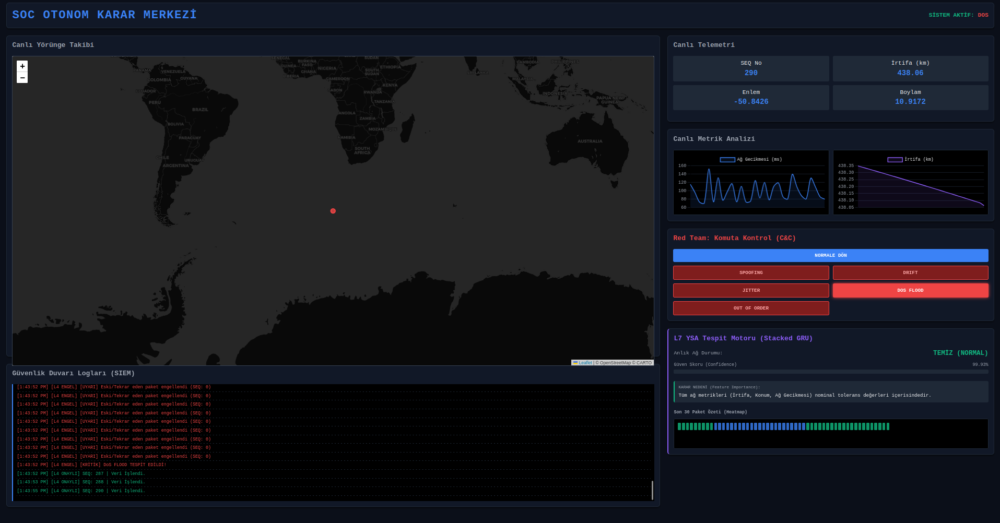
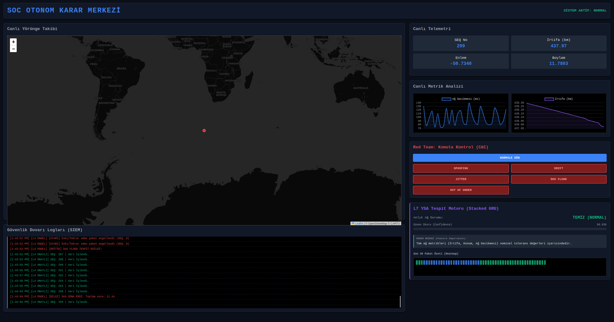

# Yapay Zeka Destekli Uydu Telemetri Güvenlik İzleme Sistemi (SOC)

> Gerçek zamanlı uydu telemetri verisi üzerinde yapay zeka destekli anomali tespiti yapan çok katmanlı siber güvenlik mimarisine sahip bir Security Operations Center (SOC) simülasyon platformu.


---

## Proje Hakkında

Bu proje, bir uydudan gönderilen telemetri paketlerinin ağ üzerinde iletilirken siber saldırılara karşı korunup korunamadığını ve anlık olarak izlenip izlenemeyeceğini araştırmak amacıyla geliştirilmiştir.

**CelesTrak API**'sinden çekilen gerçek ISS (Uluslararası Uzay İstasyonu) yörünge parametreleri (TLE verisi) kullanılarak gerçek uydu konumları üretilmiştir. Sistem, L4 katmanında kriptografik doğrulama ve hız sınırlama, L7 katmanında ise eğitilmiş bir Yinelemeli Sinir Ağı (Stacked GRU) ile anomali tespiti yapmaktadır. Tüm süreç canlı bir SOC dashboard'unda izlenebilir.

### Temel Özellikler

- **HMAC-SHA256** imzalama ile paket bütünlüğü ve kimlik doğrulama
- **L4 Güvenlik Duvarı** — DoS tespiti (rate limiting), replay saldırısı koruması, sıra dışı paket engelleme
- **Stacked GRU Modeli** — 30 paketlik kayan pencere üzerinde NORMAL / SPOOF / DRIFT / JITTER sınıflandırması
- **Gerçek Uydu Verisi** — CelesTrak TLE + PyEphem ile anlık ISS koordinatları
- **Canlı SOC Dashboard** — Leaflet harita, Chart.js metrik grafikleri, SIEM log akışı, XAI karar gerekçesi, ısı haritası
- **Red Team Kontrol Paneli** — Dashboard üzerinden canlı saldırı simülasyonu
- **Tam Docker** desteği — tek komutla ayağa kalkan 4 servisli izole ağ ortamı
- **Otomatik Veri Seti** toplayıcı — etiketli CSV kaydı ile yeni model eğitimine hazır altyapı

---

## Sistem Mimarisi

Sistem, izole bir Docker bridge ağı (`172.20.0.0/24`) üzerinde haberleşen 4 servisten oluşmaktadır.

```
┌─────────────────────────────────────────────────────────────┐
│                  Docker Bridge Network (172.20.0.0/24)       │
│                                                             │
│  ┌──────────────┐   UDP:5005 + TCP:5006   ┌─────────────┐  │
│  │  MAKİNE 1    │ ───────────────────────▶│  MAKİNE 2   │  │
│  │  (.0.2)      │   Binary Telemetri      │  (.0.3)     │  │
│  │  Sender      │   + HMAC İmzası         │  Receiver   │  │
│  │              │                         │  + YSA      │  │
│  └──────────────┘                         └──────┬──────┘  │
│                                                  │         │
│  ┌──────────────┐   network_mode: service:m2     │HTTP     │
│  │  MAKİNE 3    │◀── Paket Koklama (Scapy)      │:8000    │
│  │  (.0.3 paylaşımlı) Saldırı Motoru             ▼         │
│  │  Attacker    │                         ┌─────────────┐  │
│  │  Red Team    │◀── TCP:5007 C&C Komutu ─│  MAKİNE 4   │  │
│  └──────────────┘                         │  (.0.5)     │  │
│                                           │  Dashboard  │  │
│                                           │  FastAPI+WS │  │
│                                           └─────────────┘  │
│                                                  │         │
│                                           PORT 8000:8000   │
└──────────────────────────────────────────────────┼─────────┘
                                                   ▼
                                            Tarayıcı (SOC UI)
```

### Servis Açıklamaları

| Servis | IP | Görev |
|---|---|---|
| `machine1_sender` | 172.20.0.2 | CelesTrak'tan gerçek TLE verisi çeker, PyEphem ile ISS koordinatlarını hesaplar, HMAC imzalı binary UDP paketi üretir ve gönderir. TCP heartbeat ile bağlantıyı izler. |
| `machine2_receiver` | 172.20.0.3 | Gelen paketlerde imza doğrulama, DoS koruması ve replay koruması yapar (L4). Ardından Stacked GRU modeli ile anomali sınıflandırması (L7) yapıp sonucu Machine 4'e iletir. |
| `machine3_attacker` | 172.20.0.3 (paylaşımlı) | Scapy ile ağ trafiğini koklar. Machine 4'ten C&C komutu alarak SPOOF, DRIFT, JITTER, DoS ve Out-of-Order saldırıları simüle eder. |
| `machine4_dashboard` | 172.20.0.5 | FastAPI tabanlı REST API ve WebSocket sunucusu. SOC dashboard'unu sunar, etiketli veri setini CSV olarak kaydeder, Red Team komutlarını Machine 3'e iletir. |

---

## Güvenlik Katmanları

### L4 — Ağ/Transport Katmanı Koruması

Makine 2, YSA'ya paket ulaşmadan önce üç kontrol uygular:

**1. HMAC-SHA256 İmza Doğrulama**
Her paket `24 byte veri + 32 byte HMAC imzası` formatındadır. Makine 1 ve 2'nin paylaştığı gizli anahtar ile imza yeniden hesaplanır, eşleşmezse paket düşürülür. Bu, ağ üzerindeki veri manipülasyonunu (Makine 3'ün SPOOF denemelerini) önlemenin temel mekanizmasıdır.

> Not: Makine 3 bu projede kasıtlı olarak aynı gizli anahtara sahip bir "içeriden tehdit / anahtar çalmış saldırgan" senaryosunu simüle etmektedir. Bu sayede imza doğrulamasını geçen ama anormal olan paketler üretebilir ve YSA'nın bu tür saldırıları tespit edip edemeyeceği test edilir.

**2. DoS Rate Limiting**
Saniyede 10'dan fazla paket gelirse flood tespiti tetiklenir. Saldırı boyunca sonraki paketler sessizce düşürülür, YSA ve dashboard gereksiz yük altına girmez.

**3. Replay / Out-of-Order Koruması**
Her paketin artan bir sequence numarası (`seq_id`) vardır. Gelen paketin numarası son kabul edilenden küçük veya eşitse paket reddedilir. Bu, yakalanan eski paketlerin tekrar oynatılmasını engeller.

### L7 — Uygulama Katmanı (YSA Tespiti)

L4'ten geçen paketler, **30 paketlik kayan pencere tamponu**na eklenir. Tampon dolduğunda Stacked GRU modeli tahmin üretir.

---

## YSA Modeli: Stacked GRU

### Mimari

```
Girdi: (1, 30, 5)  →  30 zaman adımı, 5 özellik
  │
  ├─ GRU(64, return_sequences=True)
  ├─ BatchNormalization + Dropout(0.3)
  ├─ GRU(32, return_sequences=False)
  ├─ BatchNormalization + Dropout(0.3)
  ├─ Dense(32, activation='relu') + Dropout(0.2)
  └─ Dense(4, activation='softmax')

Çıktı: [NORMAL, SPOOF, DRIFT, JITTER]
```

### Öznitelik Çıkarımı

Ham koordinat verisini (lat, lon, alt) doğrudan modele vermek yerine, saldırı türlerini daha iyi ayırt eden türetilmiş özellikler kullanılmıştır:

| Özellik | Açıklama | Tespit Ettiği |
|---|---|---|
| `delta` | Paketin ağdaki geçikme süresi (ms) | JITTER |
| `lat_diff` | Ardışık enlem farkı | SPOOF |
| `lon_diff` | Ardışık boylam farkı | SPOOF |
| `lat_residual_std` | 30 paketlik pencerede doğrusal eğimden sapma | DRIFT |
| `lon_residual_std` | 30 paketlik pencerede doğrusal eğimden sapma | DRIFT |

### Model Geliştirme Süreci

Önce bir **1D CNN + GRU hibrit modeli** denenmiştir. Bu model özellikle DRIFT sınıfında yetersiz performans göstermiş kümülatif mikro-sapmaları birikimli olarak öğrenememesi nedeniyle kullanılmamıştır. Ardından saf zaman serisi modellemesine odaklanan **Stacked GRU** mimarisi eğitilmiş ve istenen sınıflandırma başarısı elde edilmiştir. Her iki modelin eğitim kodu `training_and_data/` klasöründe mevcuttur.

### Eğitim Detayları

- Eğitim ortamı: Google Colab
- Optimizasyon: Adam (lr=1e-3), EarlyStopping + ReduceLROnPlateau
- Dengesiz sınıf problemi için: `compute_class_weight` ile ağırlıklı eğitim
- Veri bölümü: %70 eğitim / %15 validasyon / %15 test

---

## SOC Dashboard

Dashboard, `http://localhost:8000` adresinden tarayıcı üzerinden erişilen tek sayfalık bir uygulamadır.










**Paneller:**

- **Canlı Yörünge Haritası** — Leaflet.js + CartoDB dark tile katmanı ile ISS'nin anlık konumu
- **Canlı Telemetri** — SEQ numarası, irtifa (km), enlem, boylam
- **Metrik Grafikleri** — Ağ gecikmesi (Delta) ve irtifa zaman serisi grafikleri (Chart.js)
- **Red Team C&C Paneli** — SPOOF / DRIFT / JITTER / DoS / Out-of-Order saldırılarını tek tıkla başlatma
- **L7 YSA Motoru** — Anlık sınıf kararı, güven skoru (%), XAI karar gerekçesi
- **Son 30 Paket Isı Haritası** — Her paketin renk kodlu sınıf durumu (yeşil=NORMAL, turuncu=SPOOFING, mor=DRIFT, mavi=JITTER)
- **SIEM Log Akışı** — L4 engelleme ve L7 onay logları zaman damgalı olarak akar

---

## Proje Yapısı

```
SATELLITE-SOC-PROJECT/
├── machine1_sender/
│   ├── main.py              # TLE çekme, konum hesaplama, UDP/TCP gönderici
│   ├── Dockerfile
│   └── requirements.txt
│
├── machine2_receiver/
│   ├── main.py              # L4 güvenlik duvarı + L7 GRU inferans motoru
│   ├── model.h5             # Eğitilmiş Stacked GRU modeli
│   ├── scaler.pkl           # StandardScaler (eğitimle aynı ölçekleme)
│   ├── Dockerfile
│   └── requirements.txt
│
├── machine3_attacker/
│   ├── main.py              # Scapy sniffer + saldırı motoru + C&C dinleyici
│   ├── Dockerfile
│   └── requirements.txt
│
├── machine4_dashboard/
│   ├── main.py              # FastAPI: REST API + WebSocket yayın sunucusu
│   ├── index.html           # SOC dashboard arayüzü
│   ├── static/
│   │   ├── app.js           # WebSocket istemcisi, harita, grafikler
│   │   └── style.css        # Dashboard stilleri
│   ├── Dockerfile
│   └── requirements.txt
│
├── training_and_data/
│   ├── soc_stacked_gru.ipynb   # Kullanılan model: Stacked GRU eğitim kodu
│   └── soc_cnn_gru.ipynb       # Denenen ilk model: 1D CNN + GRU hibrit
│
├── docker-compose.yml
└── soc_gorseller
```

---

## Kurulum ve Çalıştırma

### Gereksinimler

- Docker ve Docker Compose yüklü olmalı
> Not: Proje, kolay test edilebilmesi adına varsayılan bir SECRET_KEY ile çalışacak şekilde ayarlanmıştır. Çalıştırmak için ekstra .env dosyası oluşturmanıza gerek yoktur. Ancak isterseniz kendi anahtarınızı .env dosyası üzerinden SECRET_KEY tanımlayarak varsayılan değeri ezebilirsiniz.

### 1. Depoyu Klonlayın

```bash
git clone https://github.com/sametkaya-finch/satellite-soc-project.git
cd satellite-soc-project
```

### 2. Sistemi Başlatın

```bash
docker-compose up --build
```

Docker Compose, 4 servisi doğru sırayla ayağa kaldırır:
- Önce `machine2` ve ardından `machine1` başlar (depends_on)
- `machine4` port `8000`'i dışarıya açar

### 3. Dashboard'u Açın

Tarayıcıda şu adrese gidin:

```
http://localhost:8000
```

İlk 30 saniye boyunca YSA tamponu dolana kadar sistem `ANALİZ BEKLENİYOR` durumunda kalır bu normaldir.

### 4. Saldırı Simülasyonu

Dashboard'daki **Red Team: Komuta Kontrol** panelinden herhangi bir saldırı modunu başlatabilirsiniz. Saldırı türleri:

| Mod | Açıklama |
|---|---|
| `NORMAL` | Sistemi normal duruma döndürür |
| `SPOOF` | Fizik kurallarına aykırı koordinat sıçramaları üretir |
| `DRIFT` | Her pakette milimetrik ama birikimli yörünge kayması ekler |
| `JITTER` | Paket varış zamanlarına rastgele gecikmeler enjekte eder |
| `DoS Flood` | Saniyede 500 sahte paket göndererek bant genişliğini doldurur |
| `Out of Order` | Eski sequence numaralı paketleri tekrar gönderir |

---

## Sistem Mimarisi ve Teknolojiler

| Katman | Teknoloji |
|---|---|
| Uydu Verisi | CelesTrak TLE API, PyEphem |
| Ağ | Python `socket` (UDP + TCP), Scapy |
| Güvenlik | HMAC-SHA256, rate limiting, sequence kontrolü |
| YSA / ML | TensorFlow / Keras, Stacked GRU, StandardScaler, scikit-learn |
| Model Eğitimi | Google Colab |
| Backend API | FastAPI, Uvicorn, WebSocket |
| Frontend | Vanilla JS, Leaflet.js, Chart.js |
| Altyapı | Docker, Docker Compose, bridge ağı |

---

## Önemli Notlar

- Makine 3, Makine 2 ile aynı ağ namespace'ini paylaşır (`network_mode: service:makine2`). Bu sayede Scapy ile Makine 2'ye gelen trafiği görebilir. Bu bilerek yapılmış bir tasarım tercihidir "saldırgan, ağa sızmış ve gizli anahtarı ele geçirmiş" senaryosunu simüle eder.
- Sistem üretim ortamı için tasarlanmamıştır, eğitim ve demonstrasyon amaçlıdır.

---